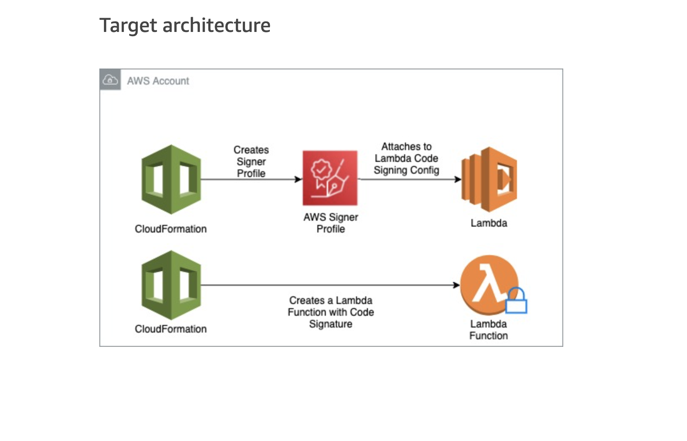

# Lambda-Code-Signer-Pattern

## Name
Lambda Code Signer Pattern

## Description
This is a code pattern used to automate the setup of code signing configuration for AWS Lambda using AWS Signer (fully managed code-signing service). This pattern will help administrators ensure that only trusted code is running inside our lambda function. This will also ensure that the Lambda function code is not altered after signing. 
[Lambda Code Signer Artifact](https://apg-library.amazonaws.com/content/514e60cd-408f-450f-95a9-f335d3bfb725)

## Architecture
The solution is based on leveraging AWS Signer to enable code signatures on AWS Lambda Function. The main services used are:

1. AWS Signer

2. AWS CloudFormation

3. AWS Lambda

4. IAM Role




## Contribution Guide

```
cd existing_repo
git clone git@github.com:aws-samples/aws-lambda-code-signing-cft-sample.git
git checkout -b feature/<feature_name> main
git add <filenames>
git commit -m "contribution message"
git push origin HEAD
```
Create a pull request with main branch and the developers/maintainers will review the request closely


## Pre-requisites
1. Developers or Architects need familiarity with AWS Lambda. AWS Lambda is being used to assign the Code Configuration in this pattern
2. Developers or Architects need experience with CloudFormation Service to deploy the pattern. CloudFormation provides an automated way to provision this solution
3. Developers or Architects need to be aware about the AWS Signer Service. AWS Signer Profile will be created and used to sign the lambda code over here
4. To run this code, developers should have an AWS VPC setup in their AWS Account and should have an associated Security group name to map this lambda function


## Limitations
1. Inline lambda code is used for the pattern instead of zipped lambda code inside S3 Bucket.
2. This pattern only focusses on mapping a Code Signer Profile to Lambda Code Configuration. No event trigger is currently present to invoke the lambda function for this example. It can be added as per your use case.

## Deployment instruction
1. Clone the repository
```
git clone git@github.com:aws-samples/aws-lambda-code-signing-cft-sample.git
```


2. Deploy AWS Cloudformation Stackset 1 - The deployment of this Cloudformation template creates a AWS Signer Profile, AWS Lambda Code Signing Configuration, and attach the Signer Profile to the AWS Lambda Code Signing Configuration. The Output resources created in this template will be used by stackset2-deploy-sample-lambda.yaml

``` shell
aws cloudformation deploy --template-file stackset1-create-signer-and-code-signing-config.yaml --stack-name <name of the stack>
```

3. Deploy AWS Cloudformation Stackset 2 - This Stackset creates and deploys a sample lambda function with Code Signing Configuration ARN imported from the template in previous epic. This lambda function has trusted signatures which are required to update or retrieve this lambda function. The lambda function does not have visibility from the AWS Console and can only be accessed with proper IAM Permissions for Lambda Code Signing Configuration.

``` shell
aws cloudformation deploy --template-file stackset2-deploy-sample-lambda.yaml --stack-name <name of stack > --parameter-overrides VPCSecurityGroup=<security-group-name> VPCSubnet1=<Subnet1-ID> VPCSubnet2=<Subnet2-ID> --capabilities CAPABILITY_NAMED_IAM 

```

## Additional Information
Code signing configuration Permissions
To grant "create/update/retrieve" code signing configuration permissions for an IAM User or IAM Role, attach one or more policy statements to the target user or role.

The Users/Developers who do not have permissions to access the CodeSigningConfig and deploy lambda function with a specific CodeSigningConfig as set by the Administrator will be unable to create, update or delete the lambda inline function or Lambda's S3 Zipped file. 

A policy in the codebase named <b>"iam-policy.json"</b> can be added to an IAM User or IAM Role so they can create, update, and retrieve code signing configurations and create a function with a specific code signing configuration


## Support
For any support, please reach out to Anmol Handa & Ram Kandaswamy


## Authors and acknowledgment
Authors - Anmol Handa & Ram Kandaswamy 

## Security

See [CONTRIBUTING](CONTRIBUTING.md#security-issue-notifications) for more information.

## License

This library is licensed under the MIT-0 License. See the LICENSE file.

## Project status
If you have run out of energy or time for your project, put a note at the top of the README saying that development has slowed down or stopped completely. Someone may choose to fork your project or volunteer to step in as a maintainer or owner, allowing your project to keep going. You can also make an explicit request for maintainers.